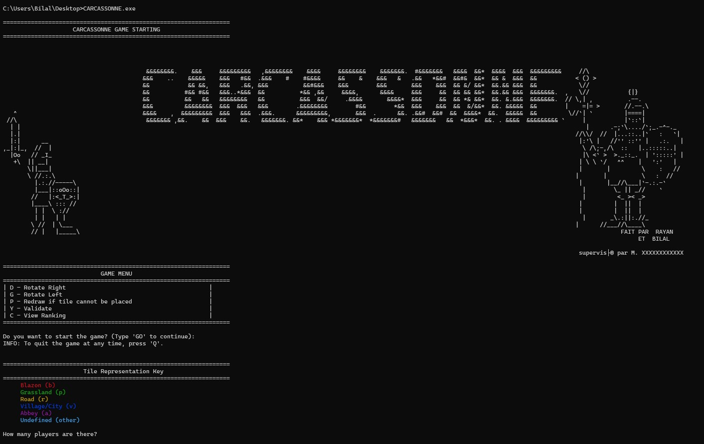

# Carcassonne Game Project

## 📌 Overview
This project is a digital implementation of the board game **Carcassonne**. It is written in **C** and designed to manage tile placement, player interactions, and game logic.


## 📂 Project Structure
```
PROJETFINALCARCASSONERAYANBILAL/
│-- .vscode/          # VS Code configuration files
│-- data/             # Contains game-related CSV files
│   ├── test          # Test data
│   ├── tuiles_base_simplifiees # Simplified tile data
│-- include/          # Header files
│   ├── game.h        # Game logic
│   ├── player.h      # Player management
│   ├── tile.h        # Tile definitions
│-- obj/              # Compiled object files
│   ├── game.o        # Game logic compiled
│   ├── main.o        # Main program compiled
│   ├── player.o      # Player management compiled
│   ├── tile.o        # Tile definitions compiled
│-- src/              # Source code files
│-- main.c            # Main program
│-- Makefile          # Compilation instructions
```

## 🛠️ Compilation Instructions
To compile the project, use the **Makefile** provided.

### **1️⃣ Compile the Project**
Run the following command:
```sh
gcc -Wall -O3 -o main obj/main.o obj/tile.o obj/player.o obj/game.o
```
Or use:
```sh
make
```

### **2️⃣ Clean Compiled Files**
To remove all compiled `.o` files, run:
```sh
make clean
```

## 🚀 Usage
After compiling, run the executable:
```sh
./main
```

## 🔧 Dependencies
- **GCC** compiler (`gcc`) for building the project.
- **Make** for using the Makefile commands.

## 📌 Analysis Report
### **Introduction**
This report analyzes the board game **Carcassonne** for its implementation in **C**. Carcassonne is a strategic tile-placement game where players build a medieval landscape by placing tiles representing cities, roads, fields, and monasteries.

Our objective is to examine the key game elements such as tiles, meeples, the draw pile, players, and group management to propose a structured implementation approach in **C**.

### **Game Elements**
- **Tiles**: Each tile contains various landscape features such as roads, cities, fields, or monasteries.
- **Meeples**: Assigned to players to claim control over a landscape feature (e.g., a city).
- **Game**: Stores all game-related information, including the game board, players, draw pile, and game status.
- **Draw Pile**: The set of remaining tiles available for players to draw from.
- **Player**: Each player has an identifier, score, and available meeples.

### **Gameplay Mechanics**
1. **Tile Placement**: Players draw a random tile and place it adjacent to existing tiles, ensuring correct alignment.
2. **Meeple Placement**: Players may place a meeple on the newly placed tile to claim a feature.
3. **City & Road Construction**: Completing a city or road awards points.
4. **Field Management**: Fields provide points at the end of the game based on adjacency to completed cities.
5. **Point Calculation**: Players score points based on completed features.

### **Key Features**
1. **Game Initialization**: Set up initial tiles and assign meeples to players.
2. **Tile Drawing**: Randomly select and place tiles while maintaining game rules.
3. **Meeple Placement**: Ensure valid placement of meeples.
4. **Scoring System**: Calculate points for completed features.
5. **Draw Pile Management**: Handle tile distribution and reshuffling if needed.

### **Scoring System**
- **Complete City**: Each city tile earns points, with bonuses for unique features.
- **Completed Road**: A completed road awards points per segment.
- **Fields**: Fields provide points based on adjacent completed cities.
- **Monasteries**: Fully surrounded monasteries score maximum points.
- **Remaining Meeples**: Unused meeples contribute additional points.

### **Conclusion**
By implementing structured data models and game mechanics, it is possible to create a functional **C** version of Carcassonne. Efficient data structures and algorithms will ensure a smooth gaming experience.

